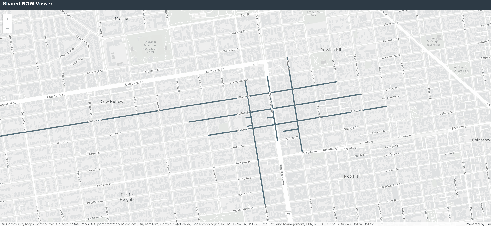

# Shared Right-of-Way Viewer

A lightweight web application that visualises street right-of-way (ROW) cross-section data using the [shared-row specification](https://github.com/d-wasserman/shared-row) and the ArcGIS Maps SDK for JavaScript (v4.29).

---


---

## Overview

Urban street rights-of-way contain many distinct slice types — sidewalks, drive lanes, bike lanes, parking, medians, transit lanes, and more. The shared-row spec encodes these allocations as structured JSON attached to street segments.

This viewer renders each segment's cross-section as a proportional-width diagram directly inside the ArcGIS map popup, making it easy to explore and audit ROW allocations at a glance.

## Features

- Interactive map of street segments with click-to-inspect popups
- Proportional-width cross-section diagram per segment
- Color-coded slice types with direction indicators (↑ forward / ↓ reverse / ↕ bidirectional)
- Elevated elements (e.g. sidewalk building fronts) rendered slightly taller than at-grade elements
- Legend listing each slice type and width in meters
- Sample data covering segments in San Francisco, CA

## Data Schema

Each GeoJSON feature carries a `slices` property (a JSON string) containing an array of slice objects:

| Field | Type | Description |
|---|---|---|
| `type` | string | See Slice Types table below |
| `width` | number | Real-world width in meters |
| `height` | number | Elevation in meters (0 = at-grade) |
| `direction` | string | `forward`, `reverse`, or `bidirectional` |
| `material` | string | Surface material (e.g. `asphalt`, `concrete`) |
| `meta` | string/null | Type-specific extra data as a JSON string |

## Slice Types

| Category | Slice Type |
|---|---|
| Automotive | `drive_lane`, `turn_lane` |
| Non-Automotive | `sidewalk`, `bike_lane`, `bus_lane`, `transit`, `path` |
| Mixed | `limitless` |
| Curb Zone | `flex_zone`, `parking`, `parklet`, `commercial_loading`, `passenger_loading`, `transit_stop`, `commercial_activity`, `bike_parking`, `bike_share`, `dockless_parking`, `construction_zone`, `tow_away_zone` |
| Miscellaneous | `median`, `buffer`, `temporary`, `transit_shelter`, `planting_strip`, `filter_strip`, `canal` |

## File Structure

```
shared-right-of-way-viewer/
├── index.html                  # Main application (ArcGIS JS API 4.29)
├── data/
│   └── slice_spec_sample.geojson   # Sample street segments (San Francisco)
└── README.md
```

## Running Locally

The app uses a `GeoJSONLayer` which requires an HTTP context (not `file://`):

```bash
python -m http.server 8080
```

Then open `http://localhost:8080` in your browser.

## Technology

- [ArcGIS Maps SDK for JavaScript 4.29](https://developers.arcgis.com/javascript/latest/)
- [shared-row specification](https://github.com/d-wasserman/shared-row)
- Vanilla JavaScript — no build step required
